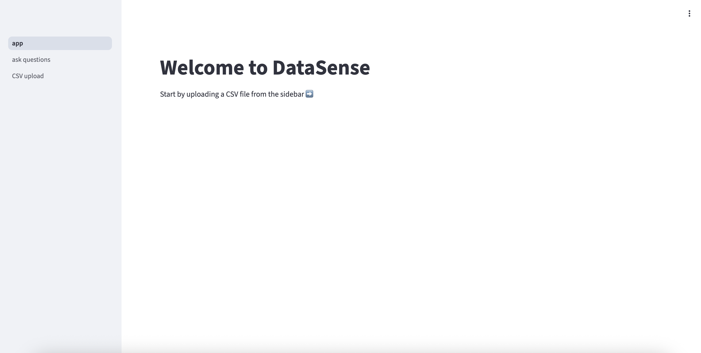
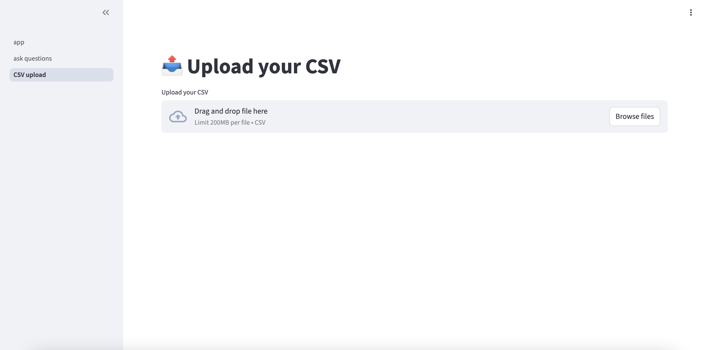

# DataSense AI

**Natural-Language Q\&A and Visualization over CSVs (and future SQL sources) with LangGraph + FastAPI + Celery + Redis + DuckDB + S3**

> Ask questions about a dataset in plain English, get charts and stats back as artifacts, and scale the workflow with a production-style backend. This repository implements a multi-tenant, cache-first pipeline with deterministic S3 outputs and async task execution.

---

## Table of Contents

* [Why DataSense AI](#why-datasense-ai)
* [High-Level Features](#high-level-features)
* [Architecture](#architecture)
* [Data Flow](#data-flow)
* [Components](#components)
* [API Reference](#api-reference)
* [S3 Layout & Artifacts](#s3-layout--artifacts)
* [Caching Strategy](#caching-strategy)
* [Agent Design & Tools](#agent-design--tools)
* [Local Development](#local-development)
* [Docker & Compose](#docker--compose)
* [Observability](#observability)
* [Load Testing & Benchmarks](#load-testing--benchmarks)
* [Security & Multi‑Tenancy](#security--multi-tenancy)
* [Production Deployment (EC2)](#production-deployment-ec2)
* [Roadmap & Future Work](#roadmap--future-work)
* [FAQ](#faq)
* [Contributing](#contributing)
* [License](#license)

---

## Why DataSense AI

Traditional dashboards require up‑front modeling and manual chart building. DataSense AI lets you **ask questions in natural language** and returns:

* **Visualizations** (e.g., distributions, trends) as **image artifacts**
* **Summary statistics** as **JSON artifacts**
* (Planned) **Executed SQL and Python snippets** for reproducibility

It is designed to be **resume‑grade** and **production‑leaning**:

* **Async pipeline** via Celery keeps the API responsive under load
* **Cache-first** design (Redis) eliminates repeat compute on cache hits
* **Deterministic S3 paths** make artifacts easy to fetch and cache on the frontend
* **LangGraph agent** orchestrates tool usage with room for self‑reflection and multi‑intent decomposition

---

## High-Level Features

* **Two clean endpoints**: `/upload` for presigned S3 file uploads; `/ask` to enqueue analysis jobs
* **Tools implemented**: `DistributionPlotTool`, `TrendPlotTool`, `SummaryStatsTool`, `SQLExecutorTool`
* **In‑memory analytics** with **DuckDB** for fast SQL over CSV
* **Result caching** keyed by `(file_id, question)`
* **Artifact storage** in S3 under deterministic, multi‑tenant prefixes
* **EC2‑tested** with **k6** load tests (see benchmarks)

---

## Architecture

```text
+-------------------+        +-----------+          +-----+
| Client / Frontend | -----> |  FastAPI  | <------> |Redis|
+-------------------+        +-----------+          +-----+
           |                         |                 ^
           | (PUT data.csv)         | (store metadata)|
           v                         v                 |
         +-----+   (presigned URL) +-----------+      |
         | S3  | <---------------- |  FastAPI  | -----+
         +-----+                    +-----------+
           ^                               |
           |                               | (enqueue job)
           |                               v
           |                         +-----------+        +--------+
           |                         |  Celery   | -----> | DuckDB |
           |                         +-----------+        +--------+
           |                               |
           |                               | (run tools)
           |                               v
           |                         +-----------+
           +------------------------ | LangGraph |
                                     +-----------+
                                           |
                                           | (write artifacts)
                                           v
                                         +-----+
                                         | S3  |
                                         +-----+
                                           |
                                           | (cache result)
                                           v
                                         +-----+
                                         |Redis|
                                         +-----+
                                           |
                                           v
                                     +-----------+
                                     |  FastAPI  |
                                     +-----------+
                                           |
                                           v
                                  +-------------------+
                                  | Client / Frontend |
                                  +-------------------+
```

**Stack:** FastAPI (HTTP), Celery (task queue), Redis (cache + metadata), DuckDB (query engine), S3 (artifact store), LangGraph (agent orchestration), LLM provider (OpenAI‑compatible).

---

## Data Flow

1. **Upload**: Client requests `/upload`. Backend returns a **presigned S3 URL** and stores basic metadata in Redis.
2. **Store**: Client uploads the CSV **directly to S3** using the presigned URL.
3. **Ask**: Client calls `/ask` with `file_id` and `question`.
4. **Cache Check**: Backend checks Redis for `(file_id, question)`.

   * **Hit** → return cached results immediately (zero recompute)
   * **Miss** → enqueue a Celery task
5. **Task**: Worker loads CSV into **DuckDB**, invokes the **LangGraph agent** which selects the appropriate tool(s), generates artifacts, and stores them under deterministic **S3 prefixes**.
6. **Return**: API replies with artifact pointers (S3 keys/URLs) or cached payloads.

---

## Components

### FastAPI

* Exposes `/upload` and `/ask`
* Handles presigned URL generation, metadata writes, and cache reads

### Celery Worker

* Executes long‑running jobs (LLM calls, plotting, SQL)
* Optional: run multiple workers for concurrency

### Redis

* **Cache** for `(file_id, question) → result`
* **Metadata** store for uploaded files (file name, S3 path, timestamps)

### DuckDB

* In‑memory engine for quickly querying CSV data
* Used by SQL and statistics tools

### S3

* Multi‑tenant bucket for uploaded data and produced artifacts
* Deterministic paths enable single‑GET retrieval on the frontend

### LangGraph Agent

* Decides which tool(s) to call
* (Planned) Self‑reflection loop to split multi‑intent prompts into atomic actions

### LLM Provider

* Any OpenAI‑compatible API (e.g., OpenAI, Groq). Configure via env vars.

---

## API Reference

### `POST /upload`

**Purpose**: Request a presigned URL for direct S3 upload and register basic file metadata.

**Request**

```json
{
  "file_name": "data.csv",
  "content_type": "text/csv",
  "user_id": "user_123"  // optional; for multi-tenant prefixes
}
```

**Response**

```json
{
  "file_id": "f_abc123",
  "presigned_url": "https://s3.amazonaws.com/...",
  "s3_key": "user_123/uploads/u_20250808/data.csv"
}
```

**Notes**

* Client should `PUT` the file to `presigned_url`.
* Server stores `{file_id → s3_key, user_id, uploaded_at}` in Redis.

---

### `POST /ask`

**Purpose**: Ask a question about a previously uploaded file.

**Request**

```json
{
  "file_id": "f_abc123",
  "question": "Show distribution of Sales and plot monthly trend for Profit"
}
```

**Sync Response (cache hit)**

```json
{
  "status": "ok",
  "cached": true,
  "results": [
    { "type": "image", "label": "sales_distribution", "s3_key": ".../dist_plots/sales.png" },
    { "type": "image", "label": "profit_trend", "s3_key": ".../trend_plots/profit.png" },
    { "type": "json",  "label": "summary_stats",    "s3_key": ".../results/summary_stats.json" }
  ]
}
```

**Async Behavior (cache miss)**

* The endpoint enqueues a Celery task and (optionally) returns a job ID. In the current design, it **waits** for the worker and returns results when ready (still async from the API worker’s perspective). For full async UX, pair this with **SSE/WebSockets** (see [Roadmap](#roadmap--future-work)).

**Error Responses**

* `400`: invalid `file_id` or missing file metadata
* `500`: internal errors (inspect server logs)

---

## S3 Layout & Artifacts

**Deterministic, multi‑tenant prefixing** (example):

```
user_id/uploads/upload_id/data.csv
user_id/uploads/upload_id/trend_plots/
user_id/uploads/upload_id/dist_plots/
user_id/uploads/upload_id/results.json           (optional aggregator file)
```

**Artifacts currently produced**

* **2 plot images** (trend + distribution) stored under their respective folders
* **1 JSON** with summary statistics (means, std, etc.)

This layout is designed to make the frontend a simple **single GET** per artifact.

---

## Caching Strategy

* **Key**: `(file_id, question)`
* **Value**: structured result manifest (list of artifacts and metadata)
* **Benefits**: Eliminates **100%** of repeat compute on cache hits and reduces duplicate Celery jobs to **0**.

---

## Agent Design & Tools

### Tools Implemented

1. **DistributionPlotTool** — generates histogram(s) for a specified column
2. **TrendPlotTool** — plots a trend for a specified column over time or index
3. **SummaryStatsTool** — computes summary statistics for selected columns (via DuckDB)
4. **SQLExecutorTool** — runs arbitrary SQL queries on the in‑memory DuckDB table

### Orchestration

* **LangGraph** is used to select which tool to call based on the question
* **Single‑intent first**: each tool handles one target column at a time
* **Planned**: a **self‑reflection node** to split multi‑intent prompts (e.g., “distributions for A, B, C”) into atomic actions and loop until completion

---

## Local Development

### Prerequisites

* Python **3.11+**
* Redis (local or Docker)
* AWS account & S3 bucket (or MinIO for local)
* OpenAI‑compatible API key

### Environment

Create `.env` in the project root:

```
# Server
APP_HOST=0.0.0.0
APP_PORT=8000

# Redis
REDIS_URL=redis://localhost:6379/0

# S3 / AWS
AWS_REGION=us-east-1
S3_BUCKET=datasense-userfiles
AWS_ACCESS_KEY_ID=...
AWS_SECRET_ACCESS_KEY=...

# LLM Provider (OpenAI-compatible)
OPENAI_API_KEY=...
OPENAI_API_BASE=https://api.openai.com/v1   # or Groq/OpenRouter/etc

# Feature flags
ENABLE_SQL_EXECUTOR=true
```

### Setup

```bash
python -m venv .venv && source .venv/bin/activate
pip install -U pip
pip install -r requirements.txt
```

### Run (separate terminals)

```bash
# 1) API
uvicorn app.main:app --host "$APP_HOST" --port "$APP_PORT" --reload

# 2) Celery worker
celery -A app.worker.celery_app worker --loglevel=INFO -Q default

# 3) (Optional) Flower for Celery monitoring
celery -A app.worker.celery_app flower --port=5555
```

### Quick Test

```bash
# Request a presigned URL
curl -X POST http://localhost:8000/upload \
  -H 'Content-Type: application/json' \
  -d '{"file_name":"Sample_Superstore.csv","content_type":"text/csv","user_id":"demo_user"}'

# PUT the CSV to the returned presigned URL (use curl --upload-file or any S3 tool)

# Ask a question
curl -X POST http://localhost:8000/ask \
  -H 'Content-Type: application/json' \
  -d '{"file_id":"f_abc123","question":"Show distribution of Sales and a monthly trend for Profit"}'
```

---

## Docker & Compose

A minimal `docker-compose.yml` (example):

```yaml
version: "3.9"
services:
  api:
    build: .
    command: uvicorn app.main:app --host 0.0.0.0 --port 8000
    environment:
      - REDIS_URL=redis://redis:6379/0
      - S3_BUCKET=${S3_BUCKET}
      - AWS_REGION=${AWS_REGION}
      - OPENAI_API_KEY=${OPENAI_API_KEY}
      - OPENAI_API_BASE=${OPENAI_API_BASE}
    ports:
      - "8000:8000"
    depends_on:
      - redis
  worker:
    build: .
    command: celery -A app.worker.celery_app worker --loglevel=INFO -Q default
    environment:
      - REDIS_URL=redis://redis:6379/0
      - S3_BUCKET=${S3_BUCKET}
      - AWS_REGION=${AWS_REGION}
      - OPENAI_API_KEY=${OPENAI_API_KEY}
      - OPENAI_API_BASE=${OPENAI_API_BASE}
    depends_on:
      - redis
  redis:
    image: redis:7
    ports:
      - "6379:6379"
```

Run:

```bash
docker compose up --build
```

---

## Screenshots

<p align="center">
  
  
</p>

<p align="center">
  
  
</p>

<p align="center">
  
</p>

<details>
<summary><b>Developer flow (optional)</b></summary>

<p align="center">
  
  
</p>
</details>

## Observability

* **Structured logging** from API and worker
* (Optional) **Flower** for Celery task monitoring
* **Roadmap**: Prometheus + Grafana dashboards; OpenTelemetry tracing across API → worker → tools

---

## Load Testing & Benchmarks

**Method**: k6 against the API on EC2 (FastAPI + Celery).

**Current Results (as of 2025‑08‑08)**

* **17,900** requests in ~**3 minutes** (~~**98.5 req/s**)
* **0%** errors
* **p95** latency \~ **22.81 ms**

> Results depend on instance size, dataset, prompt/tool mix, and LLM provider latency. Reproduce with the script below and your environment.

**Sample k6 script** (`k6/script.js`):

```js
import http from 'k6/http';
import { sleep } from 'k6';

export const options = {
  vus: 100,
  duration: '3m',
};

export default function () {
  const url = 'http://YOUR_API_HOST:8000/ask';
  const payload = JSON.stringify({
    file_id: 'f_abc123',
    question: 'Show distribution of Sales',
  });
  const params = { headers: { 'Content-Type': 'application/json' } };
  http.post(url, payload, params);
  sleep(0.1);
}
```

---

## Production Deployment (EC2)

1. **Provision** an EC2 instance (Linux) with security groups for HTTP(80)/HTTPS(443) and your app port (if needed)
2. **Install** Docker + Docker Compose (or system Python + services)
3. **Secrets**: use SSM Parameter Store/Secrets Manager or `.env` with strict permissions
4. **Reverse proxy**: Nginx or Caddy in front of `uvicorn` (TLS via Let’s Encrypt)
5. **Processes**: run API and Celery as services (e.g. Docker Compose)
6. **Monitoring**: enable logs collection; consider CloudWatch, Prometheus, Grafana
7. **Backups**: S3 versioning and lifecycle rules; Redis persistence if needed

---

## Roadmap & Future Work

* **Self‑Reflection Node** in LangGraph to split multi‑intent prompts (e.g., “show distributions for A, B, C”) and loop until all atomic tasks finish
* **Streaming UX**: SSE or WebSockets to stream job status and partial results to the client
* **SQL Sources**: connect directly to Postgres/MySQL/Snowflake with a credential vault and read‑only roles
* **Artifact Viewer**: frontend renders images inline and fetches JSON summaries for display
* **Observability**: Prometheus metrics, Grafana dashboards, and OpenTelemetry traces
* **Autoscaling**: containerize and deploy to ECS/EKS; scale Celery workers based on queue depth
* **Cost Controls**: per‑user quotas, per‑job token limits, cheap models with on‑demand upscaling
* **Access Control**: JWT, tenant scoping, signed artifact URLs, and audit logs
* **Testing**: end‑to‑end tests with mocked S3/Redis, and load test stage in CI
* **Data Cataloging**: schema inference with Pydantic models and validation

---


## Contributing

Contributions are welcome! Please open an issue to discuss proposals. For PRs, include:

* Clear description and screenshots (if UI)
* Unit tests for new logic
* Updated docs where applicable

---

## Acknowledgments

* **DuckDB** for fast, in‑memory analytics
* **LangGraph** for agent orchestration
* **FastAPI** for a delightful Python web framework
* **Celery** and **Redis** for simple, reliable async processing
* **k6** for approachable load testing
